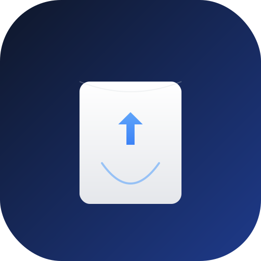

# TechTok 
TechTokは記述記事、ブログの要約を縦スクロールで読むことができるアプリです。

## 機能一覧 ⚙️
- 記事要約の縦スクロールでの閲覧
- 記事のお気に入り登録
- 技術サイトの登録　←　登録したサイトの記事が縦スクロールで流れます。
- 記事の詳細にアクセス

## 技術スタック 🛠️
- Next.js
- TypeScript
- biome.js
- Prisma
- PostgreSQL
- Vercel
- Supabase
- Auth.js

...(TODO: 増えたら追記)

