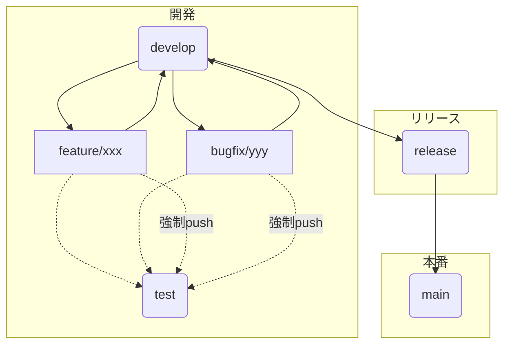

# ブランチ運用ルール

このプロジェクトでは、以下のようなブランチ運用を行います。

## ブランチ構成

- **main**: デフォルトブランチ。リリース済みの本番コード。
- **develop**: リリース前の統合ブランチ。作業ブランチのマージ先。
- **release**: リリース作業用のブランチ。developからマージし、リリース後mainへマージ。
- **test**: テスト環境用ブランチ。作業ブランチから自由にマージ・強制プッシュ可能。
- **feature/bugfix等の作業ブランチ**: developから作成し、作業後developへPull Request。

## 運用フロー

## 詳細な運用手順

1. **developから作業ブランチ（feature/xxx, bugfix/yyy等）を作成**
2. **作業ブランチで開発・修正**
3. **作業ブランチからdevelopへPull Requestを作成し、承認後マージ**
4. **リリース時にdevelopをreleaseへマージ**
5. **リリース後、releaseからmainへPull Requestを作成し、承認後マージ**
6. **testブランチには作業ブランチから自由にマージ・強制プッシュ可能。ただし、testブランチから作業ブランチへのプッシュやマージは禁止。**

---

- 作業ブランチからtestブランチへの強制プッシュ・マージは許可
- testブランチから作業ブランチへのプッシュやマージは禁止
- main, develop, releaseはPull Requestベースで運用 