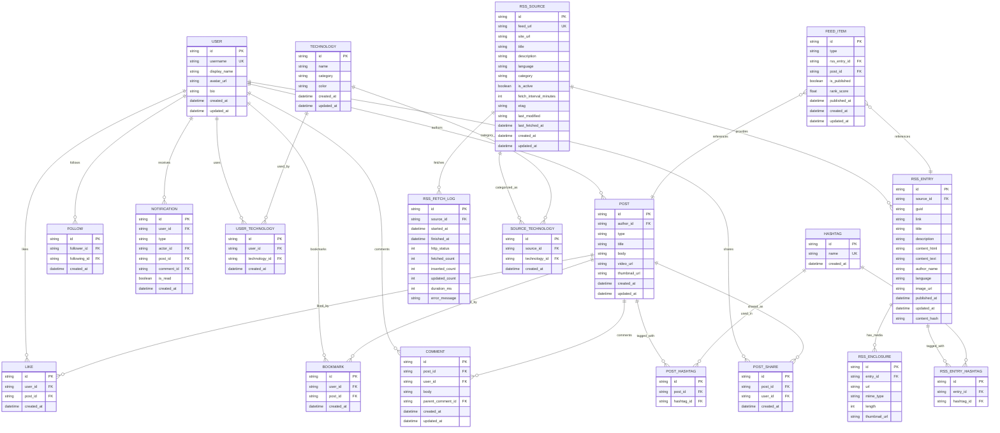

# Database Schema (Mermaid)

アプリの要件と既存の型定義から、初期リリースに必要なテーブルを定義します。データベースは PostgreSQL を想定し、Prisma などのORM導入を前提に正規化します。

補足:
- 認証は NextAuth.js を想定。必要に応じて `Account`, `Session`, `VerificationToken` を追加可能（Auth.js Prisma Adapter準拠）。
- `POST.type` は `text | video` を想定（将来リリース）。現段階のフィードは `FEED_ITEM` で `RSS_ENTRY` を参照します。
- 複合ユニーク制約（例: `LIKE(user_id, post_id)`、`BOOKMARK(user_id, post_id)`、`FOLLOW(follower_id, following_id)`、`POST_HASHTAG(post_id, hashtag_id)`、`USER_TECHNOLOGY(user_id, technology_id)`、`RSS_ENTRY(source_id, guid)`、`RSS_ENTRY_HASHTAG(entry_id, hashtag_id)`、`SOURCE_TECHNOLOGY(source_id, technology_id)`）はDBで付与してください。
- 重複排除用に `RSS_ENTRY.content_hash` を保持。
- メディアは `RSS_ENCLOSURE` に格納し、必要に応じて `thumbnail_url` を `FEED_ITEM` 描画に活用。
- 統計値は集計で取得する想定。高頻度で必要なら `post_metrics` や `user_metrics` のマテビュー/集計テーブルを別途追加。
